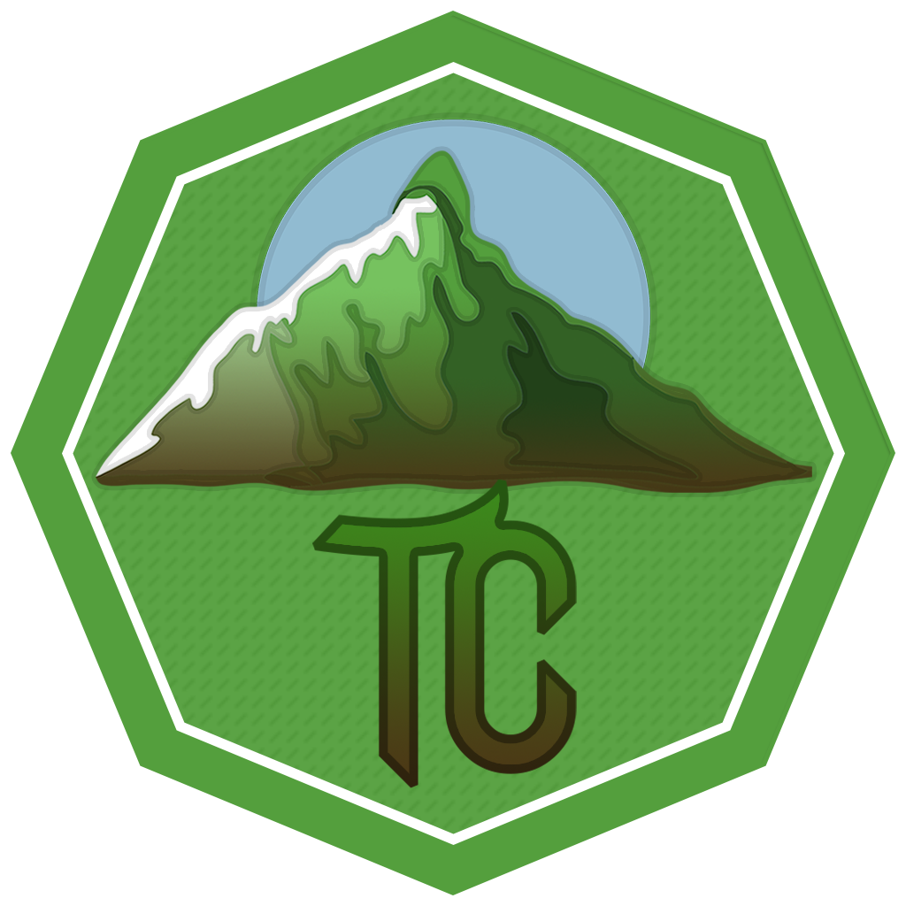

<h1 align="center">Tundracraft Resources</h1>

Recursos usados en por el <a href="https://github.com/Tundracraft-Server/TundracraftLauncher">Launcher de Tundracraft</a> para poder ser descargados. Este repositorio está separado del repositorio del Launcher para no tener que incluir todos los recursos en source.

Este repositorio contiene:
- Mods
- Configs
- Texturas
